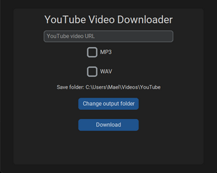

# Simple Youtube Downloader

<p align="center">

</p>

## Requirements
- Python 3.x

## Quick start

- Clone this repository
```
git clone https://github.com/iammael/Simple-Youtube-Downloader
```
- Execute **windows-install.bat** or `pip3 install -r requirements.txt`

- Start the program with **windows-start.bat** or `python simple_youtube_downloader.py`

## How it works

The program always download the video as MP4 at the best available quality (limited to 720p for now).

You can choose to further convert the video in the mp3 and/or wav format.

## To Do
- Choose download quality
	- Handle 720p+ videos
- More formats
- API
- Progress bar
